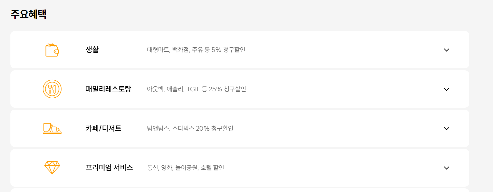

<h1> 카드 정보 조회 사이트 만들기</h1>
<h2> 개요 </h2>
카드고릴라 사이트의 카드 정보 화면 stramlit으로 구현

<h2> Streamlit 실행 화면</h2>
<figure class="half">  
  
</figure>

<h3> 카드고릴라 사이트</h3>
<figure class="half">  
  
  
</figure>

<h2> 트러블슈팅</h2>
- 날짜 데이터를 활용한 데이터 출력 사용 못함.
- 애플리케이션의 레이아웃을 설정 어려움.

<h2>시간이 난다면 더 하고픈 것</h2>
- 조회된 카드 정보가 많은 경우 페이지 별로 출력하기.
